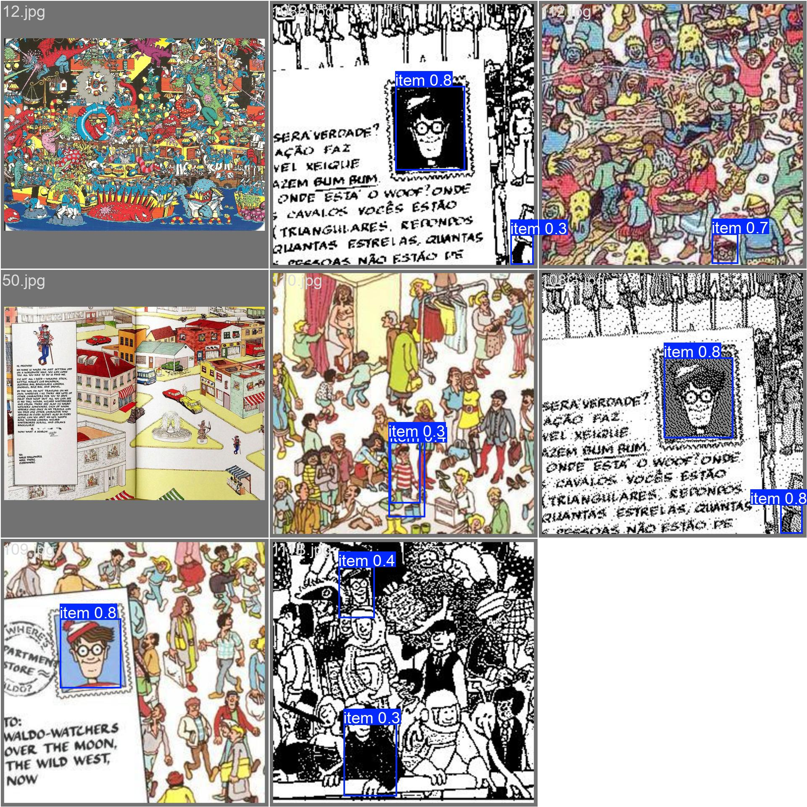
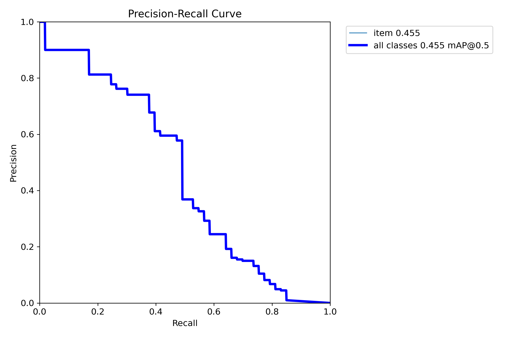

# Meet the Waldos  
### *An R–CNN Project in Two Parts*

## 📦 Overview

**Meet the Waldos** is a two-stage computer vision project that builds a custom **Region-Based Convolutional Neural Network (R-CNN)** pipeline to detect *Waldo* — the elusive character from *Where’s Waldo?* — even in highly cluttered environments. This project focuses on overcoming the challenges of limited labeled data through synthetic pretraining and transfer learning.

## 👥 Team

- Matt Galindo  
- Sepehr Akbari  

**Course:** CSCI 450 — Computer Vision and Machine Learning  
**Project:** Final Capstone Project

## 🗃️ Datasets

| Alias        | Full Name                              | Author            | Source                                                                 |
|--------------|-----------------------------------------|-------------------|------------------------------------------------------------------------|
| **Cellwaldo**| Lung and Colon Cancer Histology         | Larxel            | [Kaggle](https://www.kaggle.com/datasets/andrewmvd/lung-and-colon-cancer-histopathological-images) |
| **Realwaldo**| FindWaldo Dataset                       | Agnar Bjørstad    | [GitHub](https://github.com/agnarbjoernstad/FindWaldo)                |

## 🧠 Methodology

### 📍 Objective
Create a detection model that **outperforms traditional and early deep learning methods** for identifying Waldo in illustrated images.

### 🕵️ Previous Methods
- Classical feature + template matching
- Haar cascades and face detectors — ineffective on stylized images
- Early R-CNNs with limited resolution or context

### 🚀 Our Two-Part Approach

1. **Synthetic Pretraining**
   - Use the *Cellwaldo* dataset (histology images) to simulate a detection task.
   - Train a YOLOv8 model from scratch on thousands of generated examples.
   
2. **Transfer Learning**
   - Fine-tune the pre-trained YOLOv8 on *Realwaldo* pages.
   - Freeze most weights to retain learned general features, allowing specialization on low-data targets.

## 🖼️ Results (Sample)

## 🛠️ Tech Stack

- Python
- PyTorch
- YOLOv8 (Ultralytics)
- OpenCV
- Jupyter Notebook

## 🔄 Future Work

- Expand the Realwaldo dataset with data augmentation
- Explore Vision Transformers (ViT) for improved spatial reasoning
- Apply domain adaptation techniques to reduce synthetic-to-real gap

## 📁 Repository Structure

